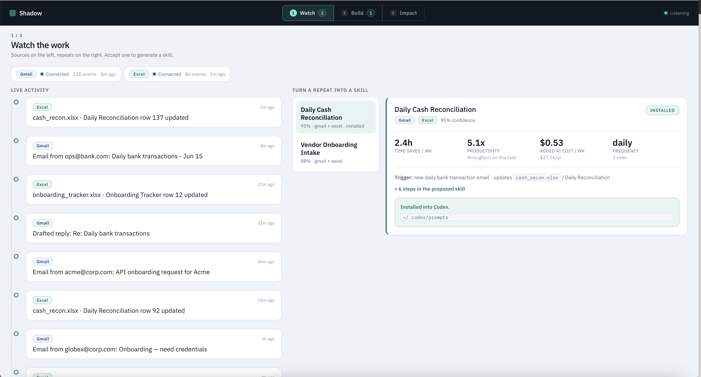
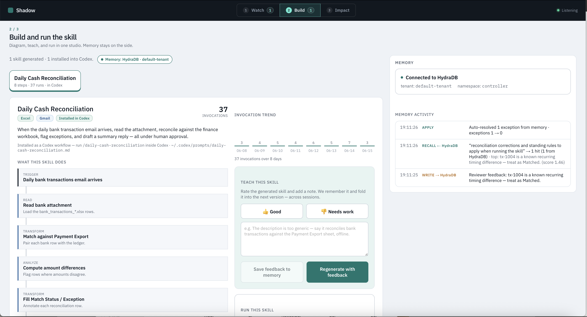
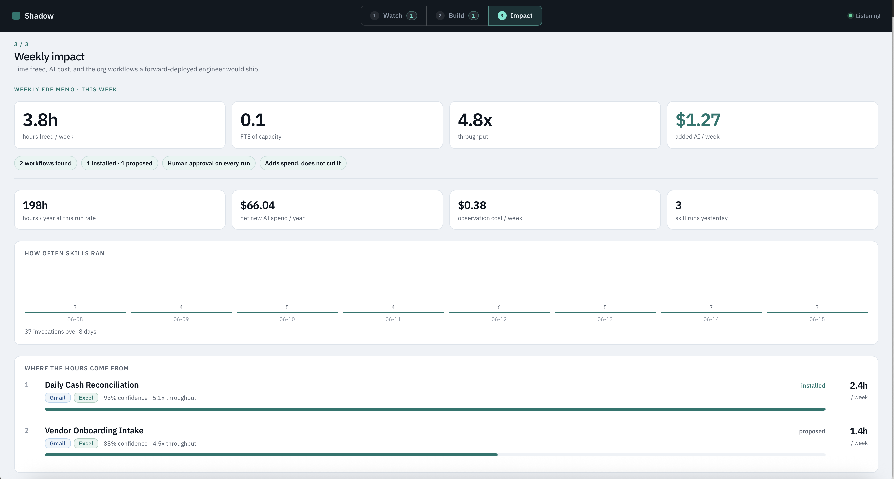

# Shadow

An AI forward-deployed engineer. It watches email and spreadsheet work, spots repeat workflows, and has **Codex** generate a guardrailed skill you can run from the dashboard — or as `/daily-cash-reconciliation` inside Codex.

The dashboard is `frontend/` — three stages: **Watch → Build → Impact**.

**Watch** — sources, activity, Accept a workflow



**Build** — skill diagram, teach/run, Memory



**Impact** — weekly hours freed and org workflows



## How it works

1. **Watch** — connect sources. Shadow turns email and spreadsheet activity into a timeline and a shortlist of workflows worth automating (with time saved and AI cost).
2. **Accept** — Codex generates a skill with triggers, steps, and human approval before any write. It installs to `~/.codex/prompts/` as a `/workflow`.
3. **Build** — see the diagram, teach an exception, run it. Memory (HydraDB, or local if no key) remembers what you taught.
4. **Impact** — weekly scoreboard: hours freed, FTE, throughput, added AI cost.

The demo workflow is **daily cash reconciliation**: a bank email with an `.xlsx` attachment → match against the finance workbook → flag exceptions → write a new reconciled spreadsheet and a reply draft. Nothing is sent or overwritten until you approve.

## Quickstart

API: `http://localhost:8017` · Dashboard: `http://localhost:5173`

```bash
# 0. Codex CLI
npm i -g @openai/codex

# 1. Key (.env.local is git-ignored)
cp .env.example .env.local            # set OPENAI_API_KEY

# 2. Backend
pip install -r requirements.txt
python -m autoskill_agent.cli skillgen-model-check
python -m autoskill_agent.api_server --host 127.0.0.1 --port 8017

# 3. Frontend (proxies /api to the backend)
cd frontend && npm install && npm run dev
```

UI-only preview (no Python): `cd frontend && VITE_USE_MOCKS=1 npm run dev`

Reset between runs: `python -m autoskill_agent.cli reset-demo --clear-memory`

## Demo (≈2–3 min)

1. **Watch** → Accept a recommendation. Codex installs `/daily-cash-reconciliation` and opens **Build**.
2. **Build → Run** → one `$10` exception is flagged; a reconciled `.xlsx` is created.
3. **Teach** — “that’s a known timing difference, treat as matched.”
4. **Run again** → it remembers (exceptions 1 → 0). Open **Impact** for the weekly scoreboard.

## Stack

Python backend (`autoskill_agent/`, `skillforge_local/`) · React + Vite frontend · OpenAI Codex CLI · optional HydraDB for memory
